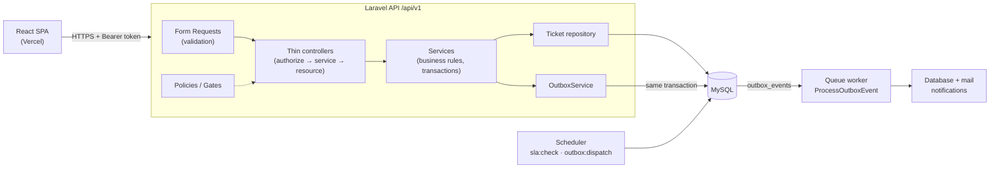

# GlobalNet Service Desk

Customer request and ticket portal for GlobalNet: customers submit tickets, agents triage, assign and resolve
them, and administrators manage teams, categories, SLA rules and users.

The project is split into two repositories:

| Part                | Repository                                                                                        | Stack                                                    |
| ------------------- | ------------------------------------------------------------------------------------------------- | -------------------------------------------------------- |
| **API** (this repo) | [globalnet-service-desk-Backend-](https://github.com/mimikhainglin2001/globalnet-service-desk-Backend-)   | Laravel 13, PHP 8.4, MySQL 8, Sanctum, database queue    |
| **Web app**         | [globalnet-service-desk-Frontend-](https://github.com/mimikhainglin2001/globalnet-service-desk-Frontend-) | React 19, TypeScript, Vite, TanStack Query, React Router |

## Live URLs

| What         | URL                                     |
| ------------ | --------------------------------------- |
| Web app      | https://globalnet-service-desk-frontend.vercel.app |
| API base URL | `https://<your-api-host>/api/v1`        |
| API spec     | [`api/docs/openapi.yaml`](api/docs/openapi.yaml) |

## Demo credentials

Every seeded account uses the password **`Password123!`**.

| Role     | Email                      | Teams                               |
| -------- | -------------------------- | ----------------------------------- |
| Admin    | `admin@globalnet.test`     | –                                   |
| Agent    | `agent@globalnet.test`     | Technical Support, Customer Success |
| Agent    | `agent2@globalnet.test`    | Billing Support, Customer Success   |
| Customer | `customer@globalnet.test`  | –                                   |
| Customer | `customer2@globalnet.test` | –                                   |
| Customer | `customer3@globalnet.test` | –                                   |

The seeders also create 3 teams, 6 categories (each routed to a team), SLA rules (Urgent 4h, High 8h, Normal
24h, Low 72h) and 10 sample tickets across all statuses.

## Repository layout

```
.github/workflows/ci.yml   Pint + PHPUnit on every push
api/                       Laravel API (details in api/README.md)
  app/                     controllers, requests, resources, services, repositories, policies, events…
  config/servicedesk.php   all business settings (SLA fallback, reopen window, upload limits, TTLs, rate limits)
  docs/openapi.yaml        OpenAPI 3 spec for every endpoint
  tests/                   57 PHPUnit tests
docker-compose.yml         app, nginx, MySQL, queue worker, scheduler
```

## Running locally

### With Docker (one command)

```bash
docker compose up --build
```

This starts MySQL (`localhost:3316`), PHP-FPM (runs migrations and seeders on start), nginx with the API on
**http://localhost:8080/api/v1**, a queue worker and the scheduler.

### Without Docker

Requirements: PHP 8.4+, Composer and MySQL 8 (or run only the database with `docker compose up mysql`).

```bash
cd api
cp .env.example .env          # set the DB_* values
composer install
php artisan key:generate
php artisan migrate --seed
php artisan serve             # http://localhost:8000/api/v1

# in two more terminals
php artisan queue:work --tries=5
php artisan schedule:work
```

Emails (password reset and notifications) go to `api/storage/logs/laravel.log`.

### Frontend

In the frontend repository:

```bash
cp .env.example .env          # VITE_API_URL=http://localhost:8000 (or :8080 with Docker)
npm install
npm run dev                   # http://localhost:5173
```

The API allows `http://localhost:5173` by default (`FRONTEND_URL` and `CORS_ALLOWED_ORIGINS` in `api/.env`).

## Architecture



- **Thin controllers, services for use cases.** Controllers only authorise, delegate and return an API
  Resource. Business rules live in services (`TicketService`, `TicketStatusService`, `IdempotencyService`,
  `OutboxService`…). DTOs carry typed input, and domain events describe what changed.
- **Repositories only where they pay off.** Ticket queries are complex (role scoping, many filters,
  full-text search, severity sorting), so they sit behind `TicketRepositoryInterface`. Simple admin CRUD uses
  Eloquent directly.
- **Authorisation on the server.** `Ticket::scopeVisibleTo()` restricts every list: customers see their own
  tickets, agents see their teams' tickets and tickets assigned to them, admins see everything.
  `TicketPolicy` guards every single-ticket action. Internal notes are filtered out in the SQL query for
  customers, not just hidden in the UI.
- **One state machine.** `TicketStatus::allowedTransitions()` defines the graph and `TicketStatusService` is
  the only place a status changes (it also enforces the 7-day reopen window). The API returns
  `allowed_transitions` so the UI only shows valid buttons.
- **Auth: Sanctum Bearer tokens instead of SPA cookies.** The SPA (Vercel) and the API run on different
  domains. Cookie auth would need a shared parent domain, `SameSite=None` third-party cookies and CSRF
  handling. Tokens avoid CSRF entirely. The trade-off is that the SPA must protect the token from XSS
  (React escapes output, no `dangerouslySetInnerHTML`). Tokens are revoked on logout, password reset and role
  change.
- **Consistent errors.** Every error is returned as `{ "message", "code", "errors"? }`, and the SPA shows
  validation errors under the matching form fields.
- **Performance.** Every list is eager-loaded and paginated, lazy loading throws outside production, and
  indexes back the main filters, the SLA scan and the outbox relay.

The full folder-by-folder breakdown is in [`api/README.md`](api/README.md#architecture).

## How the outbox and idempotency work

**Transactional outbox.** When a service changes a ticket (created, assigned, status changed, SLA breached),
it writes a domain event to `outbox_events` in the **same database transaction**. Either both are saved or
neither is. After commit, a `ProcessOutboxEvent` job is queued. A scheduled relay (`outbox:dispatch`, every
minute) re-queues any event whose job was lost, for example if the queue was down.

**Idempotent consumer.** The processor claims each event's UUID in `processed_events` (unique index) inside
the same transaction that writes the notifications. If the same event is delivered twice, the second attempt
sees it is already claimed and does nothing, so no duplicate notification is created.

**Retries and dead letters.** Jobs retry 5 times with backoff (10s, 30s, 60s, 120s). After that they land in
`failed_jobs` and the outbox row is marked failed with the error. Admins can inspect and retry both from the
**Queue health** screen (`/admin/failed-jobs`, `/admin/outbox-events`).

**Idempotent ticket creation.** `POST /tickets` accepts an `Idempotency-Key` header. The same key with the
same payload within 24 hours returns the original response (with `Idempotent-Replayed: true`) instead of
creating a duplicate. The same key with a different payload returns `409`. Keys are scoped per user. The
frontend keeps one key per submission, so double clicks and retries after network errors are safe.

More detail, including what happens if the worker crashes mid-way, is in
[`api/README.md`](api/README.md#reliable-messaging).

## Tests

```bash
cd api
composer test      # PHPUnit on SQLite in-memory (no MySQL needed)
composer lint      # Laravel Pint
```

**Backend: 57 tests.** They cover authentication (rate limiting, password reset), policies with negative
cases (other customers' tickets, internal notes, agents outside their team, admin-only endpoints), status
transitions and the reopen window, ticket creation (reference, SLA due date, routing), idempotency (replay,
conflict, per-user scope, expiry), attachment validation, the outbox (idempotent consumer, dead-lettering,
admin retry, relay) and the SLA command.

**Frontend: 23 tests** (Vitest + React Testing Library + MSW). They cover login and validation errors,
role-aware routing, ticket filters, idempotent ticket creation, optimistic status change with rollback,
hiding internal notes from customers, and the notification bell.

GitHub Actions runs lint and tests for both repositories on every push.

## Deployment

**Frontend on Vercel.** Import the frontend repository in Vercel (Vite preset) and set `VITE_API_URL` to the
API's HTTPS URL. `vercel.json` rewrites all routes to `index.html`, so deep links such as `/tickets/123`
work after a refresh.

**API on Railway.** One Railway project holds a MySQL database and three services built from the same
`api/Dockerfile`. The `CONTAINER_ROLE` variable picks what each one runs:

| Service     | `CONTAINER_ROLE` | Purpose                                                   |
| ----------- | ---------------- | --------------------------------------------------------- |
| `api`       | `web`            | nginx + PHP-FPM on Railway's `$PORT`; runs migrations and seeders on deploy |
| `queue`     | `queue`          | `queue:work`, processes outbox events and notifications  |
| `scheduler` | `scheduler`      | `schedule:work`, runs the SLA check and the outbox relay |

Each service uses **Root Directory** `/api` and these variables (MySQL values are Railway references):

```
APP_ENV=production
APP_DEBUG=false
APP_KEY=base64:...                     # php artisan key:generate --show; same value in all services
APP_URL=https://<your-api-host>
LOG_CHANNEL=stderr
DB_CONNECTION=mysql
DB_HOST=${{MySQL.MYSQLHOST}}
DB_PORT=${{MySQL.MYSQLPORT}}
DB_DATABASE=${{MySQL.MYSQLDATABASE}}
DB_USERNAME=${{MySQL.MYSQLUSER}}
DB_PASSWORD=${{MySQL.MYSQLPASSWORD}}
SESSION_DRIVER=array
CACHE_STORE=database
QUEUE_CONNECTION=database
MAIL_MAILER=log
FRONTEND_URL=https://globalnet-service-desk-frontend.vercel.app
CORS_ALLOWED_ORIGINS=https://globalnet-service-desk-frontend.vercel.app
CONTAINER_ROLE=web                     # queue / scheduler for the other two services
RUN_MIGRATIONS=true                    # api service only
RUN_SEEDERS=true                       # api service only; seeders are idempotent
```

The `api` service gets a public domain and uses `/up` as its health check. If a host cannot run a long-lived
worker, schedule `php artisan queue:work --stop-when-empty` every minute instead. The outbox relay guarantees
nothing is lost, at the cost of up to a minute of notification delay.

**CORS and Sanctum.** Only the origins in `CORS_ALLOWED_ORIGINS` are allowed (plus an optional
`CORS_ALLOWED_ORIGINS_PATTERN` regex for Vercel preview URLs). The `Idempotent-Replayed` header is exposed
to the browser. Sanctum stateful domains are not needed because the SPA uses Bearer tokens, not cookies.

## Known limitations and next steps

- Dashboard statistics are computed live. The next step is a short Redis cache, invalidated by the same
  domain events.
- No real-time push yet. The SPA polls for unread notifications; Laravel Reverb + Echo would remove the delay.
- Mail notifications are at-least-once. Database notifications are exactly-once.
- Attachments use the local disk; production should use S3-compatible storage (`ATTACHMENTS_DISK`).
- The activity timeline shows raw IDs for changed foreign keys (for example the assignee's ID).
- Only English. An i18next Burmese translation is a listed bonus.
